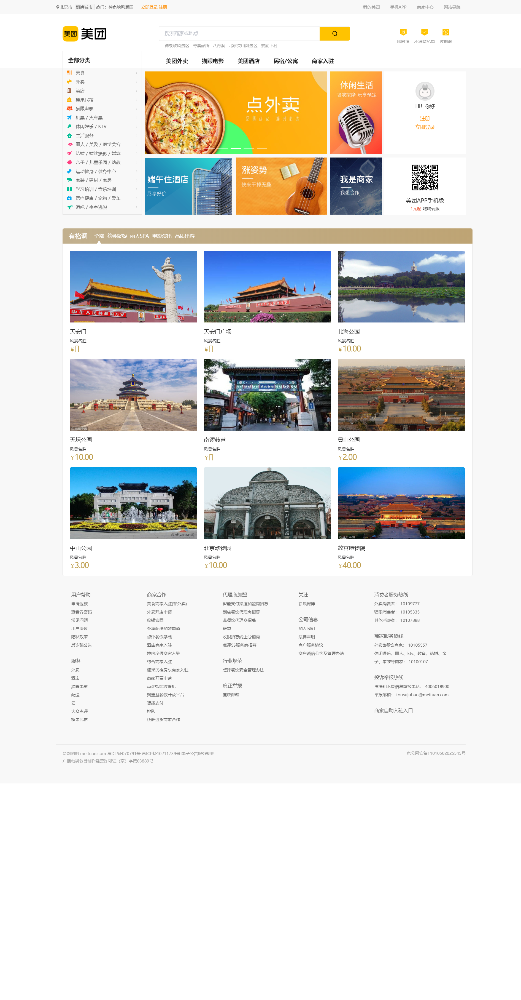
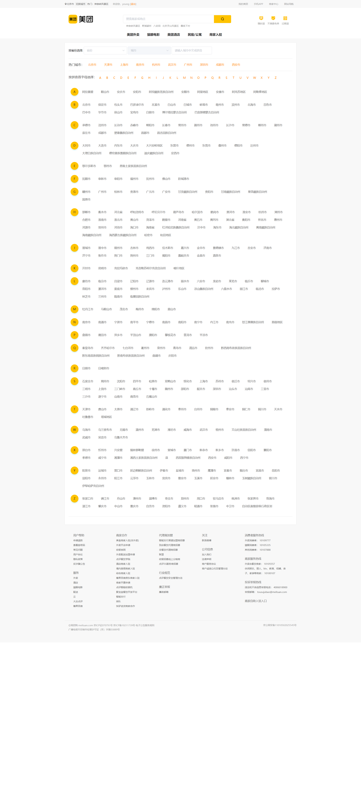
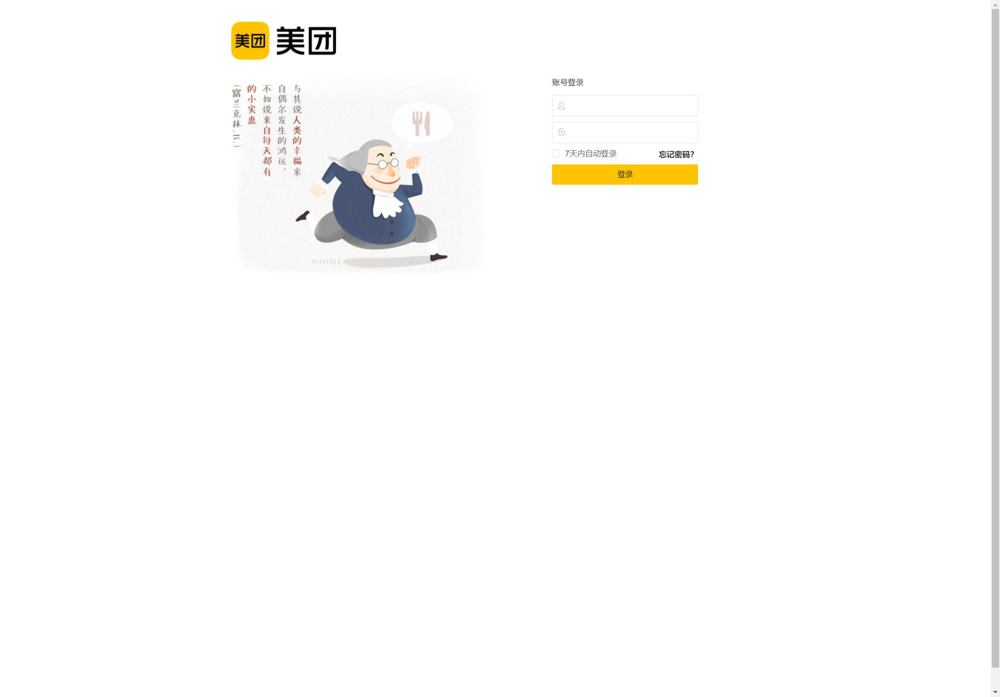
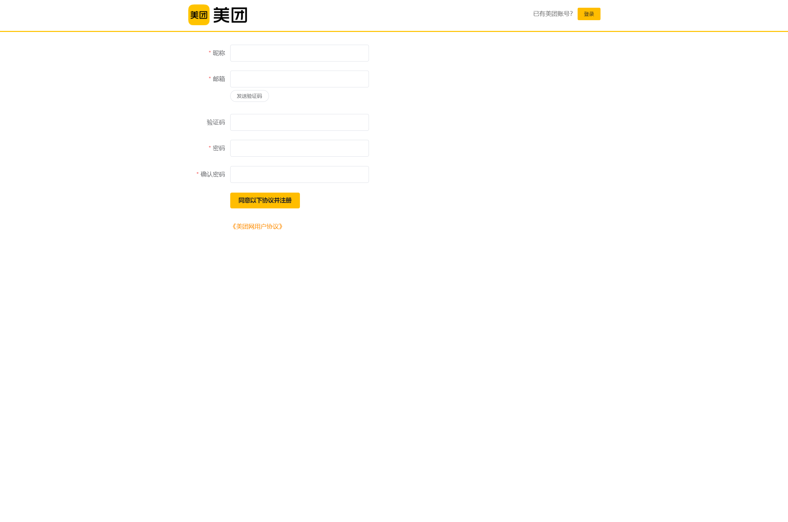
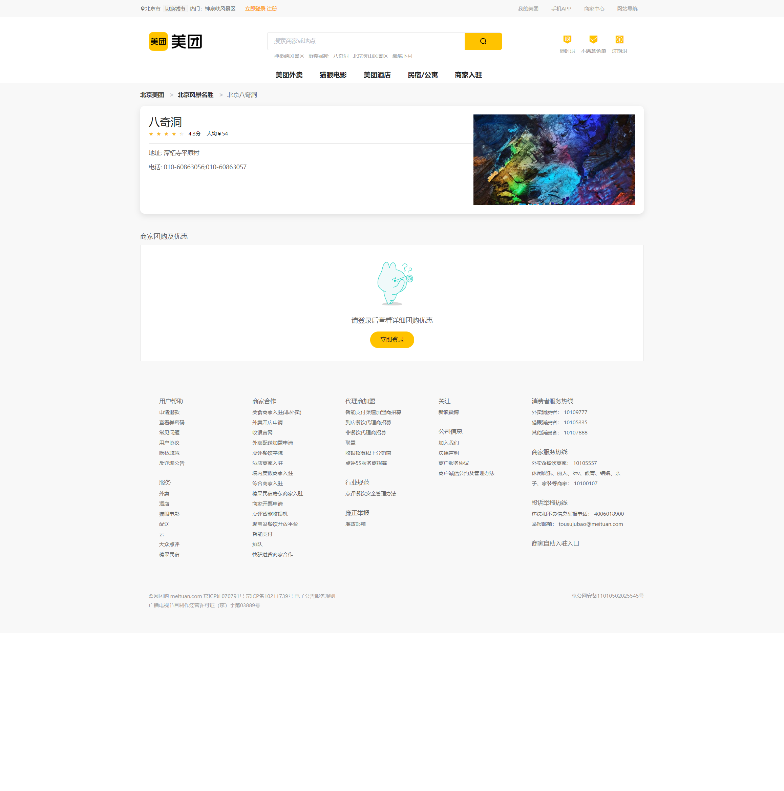
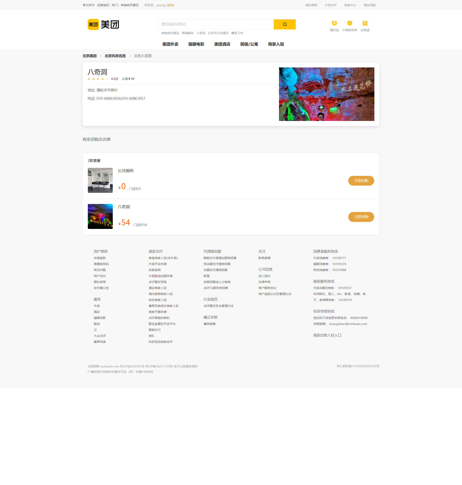
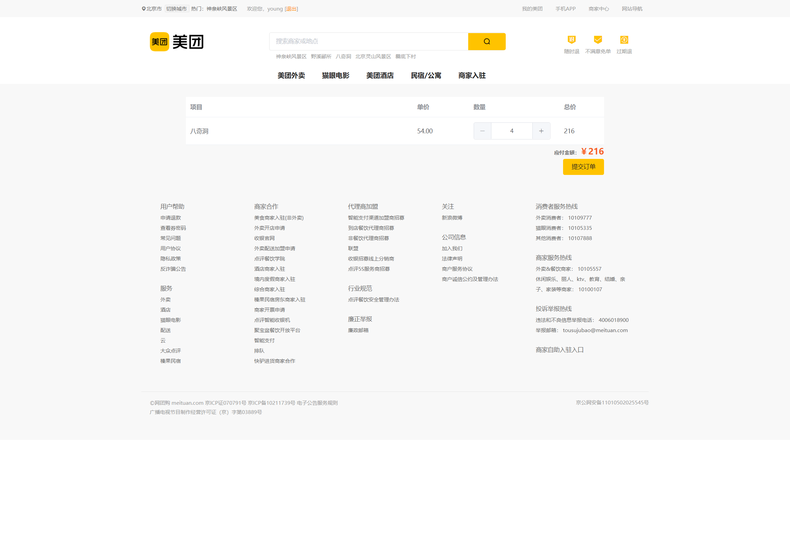
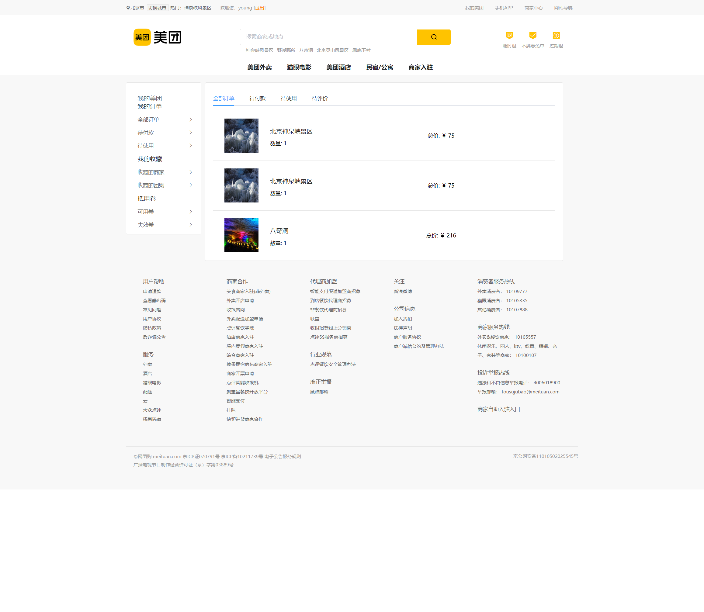

## 前言

此项目是在学习完Koa2，对服务端知识有一定的了解后做的一个练手项目，通过这个项目可以学习到Nuxt项目的构建流程，对前后端联合开发也有了更深的理解。

## 技术栈

Nuxt + Element UI + Koa2 + Mongoose + Redis

## 项目运行
**注：运行此项目需要提前开启mongodb服务和redis服务**
```
// 在mongodb/bin目录下打开cmd
mongod --dbpath D:\PF\MongoDB\data(修改为你自己的data目录)

// 在redis目录下打开cmd
redis-server.exe redis.windows.conf

// clone项目到本地
git clone https://github.com/wwwyyying/MeiTuan-rewrite.git

// 进入MeiTuan-rewrite目录
cd MeiTuan-rewrite

// 安装所需依赖
npm install

// 运行项目
npm run dev

// 打开浏览器输入 localhost:3000
```

## 主要功能

**首页**

- [x] 城市定位服务
- [x] 登录状态

**切换城市页**

- [x] 城市搜索
- [x] 下拉框选择城市
- [x] 字母表与城市列表联动

**登录/注册页**

- [x] Element UI自带的登录/注册验证
- [x] 使用QQ邮箱的SMTP服务发送注册验证码

**产品列表页**

- [x] 按照不同指标对产品进行排序
- [x] 地图服务（鼠标滑到某个元素上，地图显示该元素的位置）

**产品详情页**

- [x] 登录拦截（如果没有登录，则无法看到团购优惠活动，无法订购）

**购物车页/订单页**


## 部分截图

**首页**



**切换城市页**



**登录/注册页**




**产品列表/产品详情页**





**购物车/订单页**





## 项目布局

```
|-- MeiTuan
    |-- .babelrc
    |-- .editorconfig
    |-- .eslintrc.js
    |-- .gitignore
    |-- jsconfig.json
    |-- nuxt.config.js                                      // nuxt配置文件
    |-- package-lock.json
    |-- package.json
    |-- README.md
    |-- .nuxt                                               // nuxt build之后生成的目录
    |   |-- App.js
    |   |-- axios.js
    |   |-- client.js
    |   |-- empty.js
    |   |-- index.js
    |   |-- jsonp.js
    |   |-- loading.html
    |   |-- middleware.js
    |   |-- router.js
    |   |-- router.scrollBehavior.js
    |   |-- routes.json
    |   |-- server.js
    |   |-- store.js
    |   |-- utils.js
    |   |-- components
    |   |   |-- nuxt-child.js
    |   |   |-- nuxt-error.vue
    |   |   |-- nuxt-link.client.js
    |   |   |-- nuxt-link.server.js
    |   |   |-- nuxt-loading.vue
    |   |   |-- nuxt.js
    |   |-- mixins
    |   |   |-- fetch.client.js
    |   |   |-- fetch.server.js
    |   |-- nuxt
    |   |   |-- config.json
    |   |-- views
    |       |-- app.template.html
    |       |-- error.html
    |-- assets                                              // 一些静态资源，包括样式资源和图片资源
    |   |-- README.md
    |   |-- css
    |   |   |-- main.css
    |   |   |-- cart
    |   |   |   |-- index.scss
    |   |   |-- changecity
    |   |   |   |-- category.scss
    |   |   |   |-- categroy.scss
    |   |   |   |-- hot.scss
    |   |   |   |-- iselect.scss
    |   |   |-- detail
    |   |   |   |-- index.scss
    |   |   |-- index
    |   |   |   |-- artistic.scss
    |   |   |   |-- index.scss
    |   |   |   |-- life.scss
    |   |   |-- login
    |   |   |   |-- index.scss
    |   |   |-- order
    |   |   |   |-- index.scss
    |   |   |-- products
    |   |   |   |-- index.scss
    |   |   |-- public
    |   |   |   |-- footer.scss
    |   |   |   |-- layout.scss
    |   |   |   |-- header
    |   |   |       |-- index.scss
    |   |   |       |-- search.scss
    |   |   |       |-- topbar.scss
    |   |   |-- register
    |   |       |-- index.scss
    |   |-- img
    |       |-- logo.png
    |-- components                                          // 自定义组件
    |   |-- Logo.vue
    |   |-- README.md
    |   |-- cart                                            // 购物车组件
    |   |   |-- cartList.vue
    |   |   |-- list.vue
    |   |-- changeCity                                      // 切换城市组件
    |   |   |-- category.vue
    |   |   |-- categroy.vue
    |   |   |-- hot.vue
    |   |   |-- iselect.vue
    |   |-- detail                                          // 产品详情组件
    |   |   |-- crumbs.vue
    |   |   |-- item.vue
    |   |   |-- list.vue
    |   |   |-- summary.vue
    |   |-- index                                           // 首页组件
    |   |   |-- artistic.vue
    |   |   |-- life.vue
    |   |   |-- menu.vue
    |   |   |-- slider.vue
    |   |-- order                                           // 订单组件
    |   |   |-- list.vue
    |   |-- products                                        // 产品列表组件
    |   |   |-- categroy.vue
    |   |   |-- crumbs.vue
    |   |   |-- iselect.vue
    |   |   |-- list.vue
    |   |   |-- product.vue
    |   |-- public
    |       |-- map.vue                                     // 地图组件
    |       |-- footer                                      // footer组件
    |       |   |-- index.vue
    |       |-- header                                      // header组件
    |           |-- geo.vue
    |           |-- index.vue
    |           |-- nav.vue
    |           |-- searchbar.vue
    |           |-- topbar.vue
    |           |-- user.vue
    |-- layouts                                             // 布局目录
    |   |-- blank.vue                                       // 空布局
    |   |-- default.vue                                     // 默认布局
    |   |-- README.md
    |-- middleware                                          // 中间件
    |   |-- README.md
    |-- pages                                               // 路由目录
    |   |-- cart.vue
    |   |-- changeCity.vue
    |   |-- detail.vue
    |   |-- exit.vue
    |   |-- index.vue
    |   |-- login.vue
    |   |-- mycart.vue
    |   |-- order.vue
    |   |-- products.vue
    |   |-- README.md
    |   |-- register.vue
    |-- plugins                                             // 自定义插件
    |   |-- element-ui.js
    |   |-- README.md
    |-- server                                              // 服务端配置
    |   |-- index.js
    |   |-- dbs                                             // 数据库相关
    |   |   |-- config.js
    |   |   |-- models                                      // 模型
    |   |       |-- cart.js
    |   |       |-- category.js
    |   |       |-- categroy.js
    |   |       |-- city.js
    |   |       |-- menu.js
    |   |       |-- order.js
    |   |       |-- poi.js
    |   |       |-- pois.js
    |   |       |-- province.js
    |   |       |-- users.js
    |   |-- interface                                       // 接口文件
    |       |-- cart.js
    |       |-- category.js
    |       |-- categroy.js
    |       |-- geo.js
    |       |-- order.js
    |       |-- search.js
    |       |-- users.js
    |       |-- utils
    |           |-- axios.js
    |           |-- passport.js
    |-- static                                              // 静态资源
    |   |-- favicon.ico
    |   |-- README.md
    |-- store                                               // vuex配置
        |-- geo.js
        |-- home.js
        |-- index.js
        |-- README.md
```
